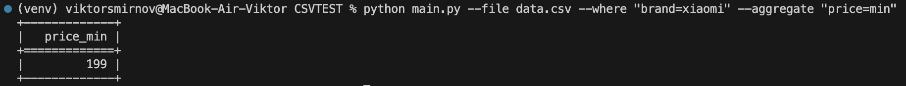

# CSV Parser

Cкрипт для обработки CSV-файла

## Возможности

- Фильтрация по значениям колонок (>, <, =)
- Агрегация числовых колонок (`avg`, `min`, `max`)
- Удобный вывод таблицы через (`tabulate`)
- Простое расширение (новые операции фильтрации, агрегации, сортировки и т.д.)
- Покрытие тестами (`pytest`)

## Установка

```bash
git clone https://github.com/Victor-git-19/CSVTEST.git
cd CSVTEST
python -m venv venv
source venv/bin/activate
pip install -r requirements.txt
```

## Запуск

```bash
# Запуск с обязательным указанием файла CSV
python main.py --file data.csv

# Запуск с фильтрацией (например, выбрать товары с ценой больше 500)
python main.py --file data.csv --filter "price>500"

# Запуск с агрегацией (например, среднее значение цены)
python main.py --file data.csv --agg "price=avg"

# Совместное использование фильтрации и агрегации (минимальная цена среди товаров бренда xiaomi)
python main.py --file data.csv --where "brand=xiaomi" --aggtegate "price=min"
```

## Запуск тестов

Для проверки корректности работы проекта используется `pytest`.

### Шаг 1. Установка pytest

Если `pytest` ещё не установлен, установи его командой:

```bash
pip install pytest
```

### Шаг 2. Запуск тестов

```bash
python -m pytest -v
```


## Примеры запуска скрипта

# Запуск скрипта с указанием файла
```bash
python main.py --file data.csv
```


# Запуск с фильтрацией (например, цена > 500)
```bash
python main.py --file data.csv --where "price>500"
```


# Запуск с агрегацией (например, среднее значение цены)
```bash
python main.py --file data.csv --aggregate "price=avg"
```


# Совместное использование фильтрации и агрегации
```bash
python main.py --file data.csv --where "brand=xiaomi" --aggregate "price=min"
```

